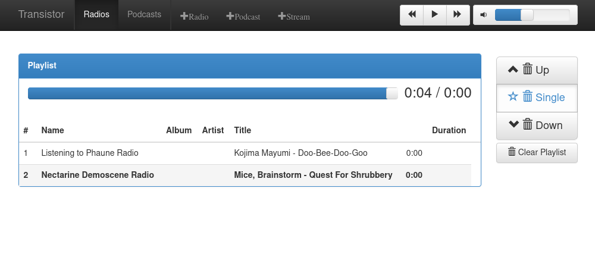
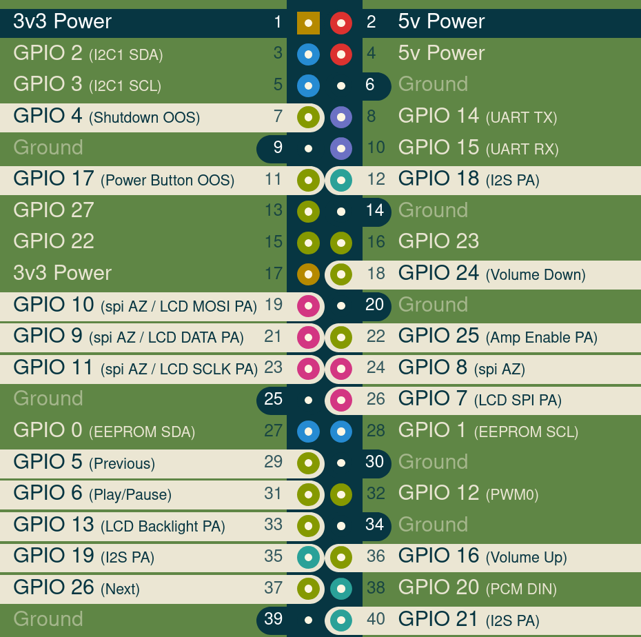

# Transistor 

Build your own radio set and listen to web radios, podcasts, bluetooth and audio files.  
Build it from anything you like, an old radio, a cardboard box, a 3d printed model or a toaster.

All you need is to copy this software to a micro SD card and insert it in the following hardware:

- [Raspberry Pi Zero W](https://shop.pimoroni.com/products/raspberry-pi-zero-w?variant=39458414297171)
- Micro SD card (4GB should be enough if you don't want to store anything on it. If you want to store music or podcasts on your device then the bigger the better.)
- [Pirate Audio 3W Stereo Amp](https://shop.pimoroni.com/products/pirate-audio-3w-stereo-amp)
- A pair of [5W 4 Ohm 65mm Full Range Speaker](https://shop.pimoroni.com/products/5w-4-ohm-65mm-full-range-speaker)
- [On / Off switch](https://shop.pimoroni.com/products/onoff-shim)
- [Colourful Arcade Buttons](https://shop.pimoroni.com/products/colourful-arcade-buttons?variant=3030992879626) (For the On / Off switch)
- [USB A to microB cable - Red – 10cm](https://shop.pimoroni.com/products/usb-a-to-microb-cable-red?variant=32065140554) (To connect the On / Off switch power micro USB to the battery charger.)
- [Adafruit PowerBoost 1000 Charger - Rechargeable 5V Lipo USB Boost @ 1A - 1000C](https://shop.pimoroni.com/products/powerboost-1000-charger-rechargeable-5v-lipo-usb-boost-1a-1000c)
- [LiPo Battery Pack – 2000mAh](https://shop.pimoroni.com/products/lipo-battery-pack?variant=20429082247) (more mAh means more autonomy, bigger is better but also more expensive)
- [Right-angle Panel Mount Extension Cables (25cm) – USB micro-B](https://shop.pimoroni.com/products/right-angle-panel-mount-extension-cables-25cm?variant=32013609631827) (To connect to the battery charger and provide a power plug that goes outside the radio.)
- [RasPiO Analog Zero](https://shop.pimoroni.com/products/raspio-analog-zero) (Optional. If you plug it, you will be able to use an old radio volume knob out of the box!)

The provided software is guaranted to support the hardware listed here. But it is very probable that different hardware is also supported.
If you find better hardware parts please [tell me](https://github.com/pirateradiohack/Transistor/issues/new/choose)!

## Quick Setup

- Download the [latest image](https://github.com/pirateradiohack/Transistor/releases/latest), that's the ZIP file named image. Unzip it.
- Flash the image with [etcher](https://www.balena.io/etcher/).
- Edit the file called `/etc/wpa_supplicant/wpa_supplicant.conf` and put your wifi name and password there.
- Put the SD card in your radio and turn it on.
- Connect to the web interface. If you are lucky you can simply go to http://transistor.local and the interface will appear. If that does not work on your device then read [Controlling your Transistor](#controlling-your-transistor)

## Features:
- Play **web radios** (from within the web interface, just enter the name of the radio and it will be added automatically! (thanks to radio-browser.info). Optionally you can add an http radio stream directly, or as a playlist.)
- Play your **audio files** by uploading them to `/home/transistor/audio_library/music/` via `scp`. They will appear in your media library.
- **Bluetooth speaker** (connect to the device called Transistor)
- Play your **podcasts** (connect via `ssh` and use the command `poca-subscribe add` to add a new podcast subscription. You will see your podcasts appear in your media library. They are updated every hour, use the command `poca` to update them manually.)
- **Various interfaces** to control the radio: physical buttons, web interface, command line interface and phone / desktop applications
- Automatically restores the radio station that was playing and volume level after turning off / on.
- **Sleep timer**: hold the on off button until your hear the confirmation sound (1 second) and the radio will turn off 20 minutes later. Hold it again to add another 20 minutes. You can still simply press the on/off button to immediately turn off the radio.

This one fits inside an old radio set, the white button on top is the on / off switch, and the volume knob works, Notice how the USB power plug fits nicely:  

Inside a cardboard box, the white button on top is the on / off switch:  

Here is the interface:  

## Long setup

### Getting the image
### Ready-to-write image
For your convenience you will find the latest image pre-built. Access it from the [releases](https://github.com/pirateradiohack/Transistor/releases) page. Download and unzip the latest image, it's the zip file called "image" with a date. (It is built automatically from the source code by Travis-ci.)

All you need to do is to configure your wifi on the image.

The file to edit:
- wifi: `/etc/wpa_supplicant/wpa_supplicant.conf` (edit this file as root / sudo)

You can edit the files *before* or *after* writing the image to the sd card:
- before: you can mount the `.img`.  
With a modern operating system you probably just have to click the .img.  
With Linux you can use `kpartx` (from the `multipath-tools` package) to be able to mount the partition directly: `sudo kpartx -a path/to/2019-05-23-Transistor-lite.img` followed by `sudo mount /dev/mapper/loop0p2 tmp/ -o loop,rw`  
(you will need to create the mount directory first and check what loop device you are using with `sudo kpartx -l path/to/2019-05-23-Transistor-lite.img`). Then you can edit the files mentionned above. And `sudo umount tmp`.  
You are safe to flash the image.
- after: your operating system probably automounts the partitions.

### building from source
- First clone this repository with `git clone https://github.com/pirateradiohack/Transistor.git`.  
- Configure your wifi settings: copy the file called `config.example` to `config` and edit this last one. You will see where to enter your wifi name, password and country. All 3 settings are necessary. Your changes to this file will be kept in future updates.
- Optionally configure your radio stations: If you create a file called `my-playlist.m3u` with your own list of internet radio streams, it will be installed.
If not, then you can always add stations in the web interface.
- Then build the image. (You can see the whole guide on the official RaspberryPi repo: https://github.com/RPi-Distro/pi-gen). I find it easier to use docker (obviously you need to have docker installed on your system) as there is nothing else to install, just run one command from this directory: `./build-docker.sh`. That's it. On my computer it takes between 15 and 30 minutes. And at the end you should see something like: `Done! Your image(s) should be in deploy/`  
If you don't see that, it's probably that the build failed. It happens to me sometimes for no reason and I find that just re-launching the build with `CONTINUE=1 ./build-docker.sh` finishes the build correctly.  
- You should find the newly created image in the `deploy` directory.

## Write the image to a SD card
Now that you have your image file, you need to write it to a SD card in order to put it in the Raspberry Pi. Choose you favorite method below and once you have your SD card ready you can boot your Raspberry Pi, the first boot can take a minute or two, and then your radio is ready to go.

### graphically
For a user friendly experience you can try [etcher](https://www.balena.io/etcher/) to flash the image to the SD card.

### manually
On linux (and it probably works on Mac too) an example to get it on the SD card would be:  
`sudo dd bs=4M if=deploy/2019-05-23-Piradio-lite.img of=/dev/mmcblk0 conv=fsync`
(of course you need to replace `/dev/mmcblk0` with the path to your own SD card. You can find it with the command `lsblk -f`)
Those settings are recommended by the RaspberryPi instructions.

## Controlling your Transistor

Transistor is equipped with the necessary buttons to turn it on / off, control the volume up and down, and select the next and previous radio stations. Besides that, you can control it remotely, on the network.

Transistor connects to the wifi network that was set in the config file. It should receive an IP address from the Internet router. You need to find this IP address in order to control the Transistor. There are several ways you can do that:

- For convinience, Transistor sets its own local domain. Some devices are compatible with this (Android supposedly works, but iOS does not. Linux should be fine if avahi is installed). So you can try to reach your Transistor at the address `transistor.local`.
- The command `nmap 192.168.1.0/24` can list the devices on your network (adapt the network address based on your computer's IP address, most probably the `1` could be another number). You will see a device named `transistor.local` along with its IP address.
- Or you could also check your Internet router to get the list of connected devices and their corresponding IP addresses.

### via web interface
You can control your radio via web interface: try to open `http://transistor.local` (or the IP address) in a web browser.

### via ssh with a terminal interface
If you prefer the command line, you can ssh into Transistor and then use `ncmpcpp` to get a nice terminal interface (see some screenshots here: https://rybczak.net/ncmpcpp/screenshots/).

### via an application
You can use any `mpd` client you like (a non exhaustive list of applications for various platforms can be found here: https://www.musicpd.org/clients/). If you are asked for the port number, it's the default one, 6600. And for the IP address, it's the same thing as above.

## How it is built
The image is built with the official RaspberryPi.org tool (https://github.com/RPi-Distro/pi-gen) to build a Raspbian lite system with all the software needed
to have a working internet radio stream client. It uses `mpd`.

## Developers
The most interesting bits happen in the `stage2/04-pirate-radio` directory. Where files can be added and then instructions can be set for the building tool to create the final OS image.

If you want to test the image locally, without the need to burn it to an SD card, you can use QEMU to emulate the hardware on your system and then create a virtual machine.
- Make sure you have QEMU installed for the arm architecture, you can test with `qemu-system-arm --version`.
- Set `USE_QEMU` to `"1"` or `true` in the config file and then build your image as usual.
- Download the [Buster kernel](https://github.com/dhruvvyas90/qemu-rpi-kernel/raw/master/kernel-qemu-4.19.50-buster) and the [Device Tree File](https://github.com/dhruvvyas90/qemu-rpi-kernel/raw/master/versatile-pb.dtb) in the `deploy` directory.
- Execute `qemu-system-arm -kernel kernel-qemu-4.19.50-buster -cpu arm1176 -m 256 -M versatilepb -dtb versatile-pb.dtb -no-reboot -serial stdio -net nic -net user,hostfwd=tcp::2222-:22,hostfwd=tcp::2223-:80 -append "root=/dev/sda2 panic=1 rootfstype=ext4 rw" -hda name_of_your_image`

That should boot the image. You can then `ssh` into it on `localhost` on port 2222, and use port 80 on `localhost` port 2223.

## Hardware
This is the detailed usage of the pins (thanks to https://pinout.xyz). This is mostly of interest when you want to connect the buttons.

OOS: On Off Shim  
AZ: Raspio Analog Zero  
PA: Pirate Audio Amp + LCD

Powers and grounds don't appear in the picture, here is their pinout:  
- Power 1: OOS / AZ
- Power 2: OOS / PA
- Ground 6: AZ
- Ground 9: AZ
- Ground 14: AZ
- Ground 20: AZ
- Ground 25: AZ / PA
- Ground 30: AZ
- Ground 34: AZ
- Ground 39: AZ / PA

The first channel of the Raspio Analog Zero (channel 0) is expecting to receive a potentiometer to set the sound volume:
plug the ends of the potentiometer to 3.3v and ground, then plug the wiper (usually found in the middle of the three tabs) into the first channel of the Analog Zero.

## Contribution
Issues and pull requests are welcome.
